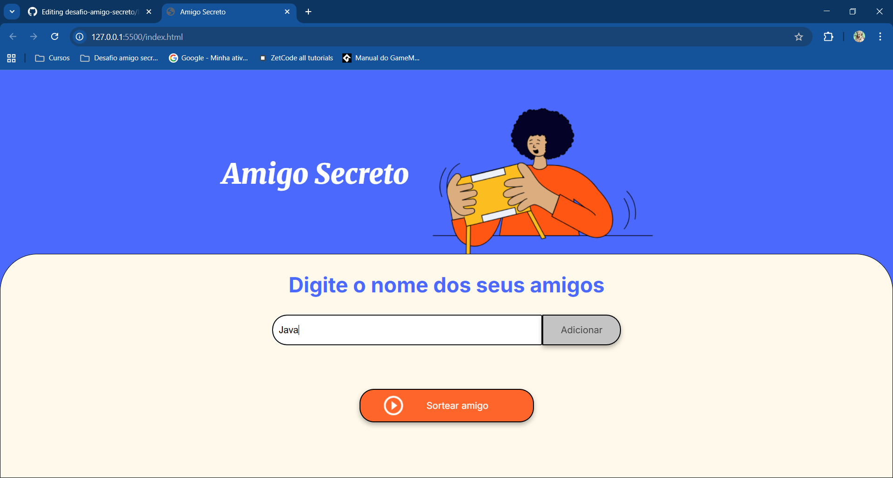
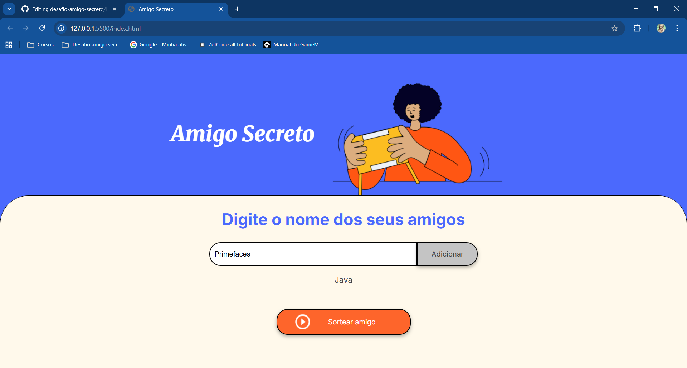
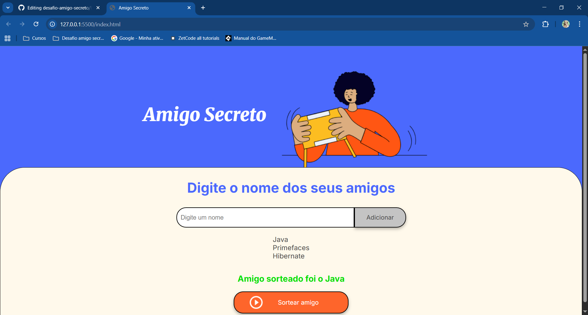

# 🎁 Desafio Amigo Secreto

Um projeto front-end desenvolvido para simular o sorteio de **Amigo Secreto** de forma prática e divertida.  
é um desafio da formação Oracle One em parceria com Alura.
O desafio consiste em inserir nomes de amigos, e sortear um para ser o amigo secreto. 

---
[Acessar o projeto no github pages](https://chagasdeveloper.github.io/desafio-amigo-secreto/)

## 🛠 Tecnologias
Este projeto foi construído utilizando:

  
  
  

### Tela Inicial

### Adicionando amigos  

### Lista de amigos 

### Resultado do Sorteio

---
## 🌐 Redes Sociais

  

